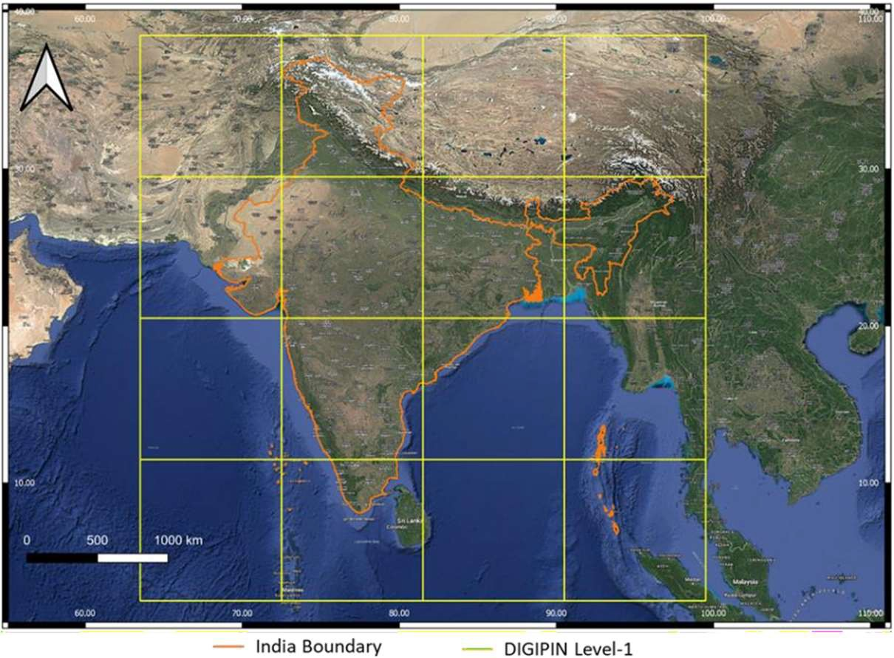
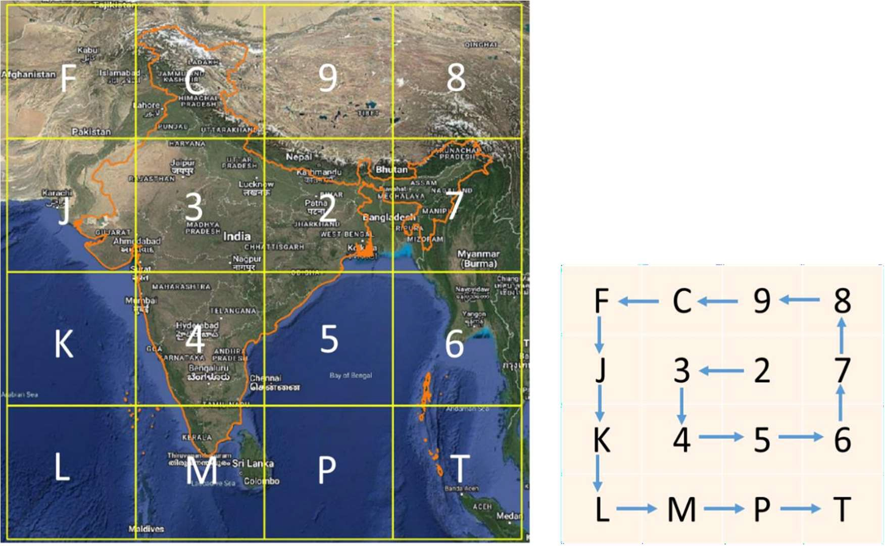

# DIGIPIN API by Department of Posts

<div align="center" style="display: flex; justify-content: center; align-items: center; gap: 20px;">
  
  
</div>

## A Geospatial Addressing Solution by India Post

DIGIPIN (Digital PIN) is a 10-character alphanumeric geocode developed by the Department of Posts, India. It provides a precise, user-friendly way to encode geographic coordinates that can be easily shared and decoded back to latitude/longitude pairs.

This open-source Node.js project exposes a public API to generate and decode DIGIPINs, supporting geolocation services, postal logistics, and spatial analysis applications.

[](https://opensource.org/licenses/Apache-2.0)
[](https://nodejs.org/)
[](https://expressjs.com/)

---

## 🏛️ About DIGIPIN

The Department of Posts has undertaken an initiative to establish a Digital Public Infrastructure (DPI) for a standardized, geo-coded addressing system in India. DIGIPIN represents the foundation layer of this infrastructure.

Developed in collaboration with IIT Hyderabad and NRSC (National Remote Sensing Centre, ISRO), DIGIPIN is an open-source national-level addressing grid that serves as a key component of India's digital address ecosystem.

After extensive public consultation and expert review, the DIGIPIN Grid has been finalized to provide simplified addressing solutions for seamless delivery of public and private services, enabling "Address as a Service" (AaaS) across the country.

### Key Highlights

- **Uniform Referencing Framework**: Provides logical, precise location identification both offline and online
- **GIS Integration**: Bridges the gap between physical and digital addresses
- **Cross-Sector Support**: Enhances service delivery across emergency response, e-commerce, logistics, BFSI, and governance
- **Policy Alignment**: Complies with the National Geospatial Policy 2022, enriching India's geospatial knowledge stack

DIGIPIN simplifies address management and enhances service delivery accuracy, promoting a thriving geospatial ecosystem for India's digital economy.

---

## ✨ Features

- **Encode**: Convert latitude and longitude into a compact 10-character DIGIPIN
- **Decode**: Transform a DIGIPIN back to its center-point coordinates
- **Lightweight**: Optimized for performance and minimal resource usage
- **RESTful API**: Clean, standard-compliant endpoints
- **Interactive Documentation**: Comprehensive Swagger UI for easy exploration
- **Production-Ready**: Built with Node.js and Express for reliability

---

## 📦 Installation

### Prerequisites

- Node.js (v14 or higher)
- npm (v6 or higher)

### Getting Started

1. **Clone the Repository**

```bash
git clone https://github.com/CEPT-VZG/digipin.git
cd digipin
```

2. **Install Dependencies**

```bash
npm install
```

3. **Environment Setup**

Create a `.env` file in the project root with the following variables:

```
PORT=5000
NODE_ENV=development
```

4. **Start the Server**

```bash
npm start
```

For development with hot reloading:

```bash
npm run dev
```

The API will be available at `http://localhost:5000`.

---

## 🚀 Quick Start Guide

1. **Clone the Repository**
   ```bash
   git clone https://github.com/CEPT-VZG/digipin.git
   cd digipin
   ```
2. **Install Dependencies**
   ```bash
   npm install
   ```
3. **Environment Setup**
   Create a `.env` file in the project root:
   ```env
   PORT=5000
   NODE_ENV=development
   ```
4. **Start the Server**
   ```bash
   npm start
   ```
   The API will be available at `http://localhost:5000`.

---

## 🧑‍💻 API Usage & Examples

### Encode Coordinates to DIGIPIN

**GET Example:**
```
GET /api/digipin/encode?latitude=12.9716&longitude=77.5946
```
**Response:**
```json
{"digipin":"4P3-JK8-52C9"}
```

**POST Example:**
```
POST /api/digipin/encode
Content-Type: application/json
{
  "latitude": 12.9716,
  "longitude": 77.5946
}
```
**Response:**
```json
{"digipin":"4P3-JK8-52C9"}
```

**Error Case:**
```
GET /api/digipin/encode?latitude=abc&longitude=77.5946
```
**Response:**
```json
{"error": "Invalid input"}
```

### Decode DIGIPIN to Coordinates

**GET Example:**
```
GET /api/digipin/decode?digipin=4P3-JK8-52C9
```
**Response:**
```json
{"latitude":12.971601,"longitude":77.594584}
```

**POST Example:**
```
POST /api/digipin/decode
Content-Type: application/json
{
  "digipin": "4P3-JK8-52C9"
}
```
**Response:**
```json
{"latitude":12.971601,"longitude":77.594584}
```

**Error Case:**
```
GET /api/digipin/decode?digipin=INVALIDCODE
```
**Response:**
```json
{"error": "Invalid DIGIPIN"}
```

### Use-Case Scenarios
- **E-commerce Delivery:** Use DIGIPIN to pinpoint delivery locations in dense urban areas.
- **Emergency Response:** Share a DIGIPIN for precise ambulance or fire service dispatch.
- **KYC/Banking:** Use DIGIPIN as a verifiable address attribute for onboarding.
- **Logistics:** Optimize route planning and reduce failed deliveries.

---

## 🌐 SDK & Code Samples

### Python Example
```python
import requests
# Encode coordinates
resp = requests.get('http://localhost:5000/api/digipin/encode', params={'latitude': 12.9716, 'longitude': 77.5946})
print(resp.json())  # {'digipin': '4P3-JK8-52C9'}
# Decode DIGIPIN
resp = requests.get('http://localhost:5000/api/digipin/decode', params={'digipin': '4P3-JK8-52C9'})
print(resp.json())  # {'latitude': 12.971601, 'longitude': 77.594584}
```

### Java Example (using OkHttp)
```java
OkHttpClient client = new OkHttpClient();
// Encode coordinates
Request request = new Request.Builder()
    .url("http://localhost:5000/api/digipin/encode?latitude=12.9716&longitude=77.5946")
    .build();
Response response = client.newCall(request).execute();
System.out.println(response.body().string());
// Decode DIGIPIN
Request request2 = new Request.Builder()
    .url("http://localhost:5000/api/digipin/decode?digipin=4P3-JK8-52C9")
    .build();
Response response2 = client.newCall(request2).execute();
System.out.println(response2.body().string());
```

---

## 🗺️ Diagrams & Visualizations

### DIGIPIN Grid System


### DIGIPIN Grid Labels


### API Flow
```mermaid
graph TD;
  A[Client] -- Encode Request --> B[API /digipin/encode];
  B -- DIGIPIN --> A;
  A -- Decode Request --> C[API /digipin/decode];
  C -- Coordinates --> A;
```

---

## 🔧 Contributing

Contributions are welcome! Please feel free to submit a Pull Request.

1. Fork the repository
2. Create your feature branch (`git checkout -b feature/amazing-feature`)
3. Commit your changes (`git commit -m 'Add some amazing feature'`)
4. Push to the branch (`git push origin feature/amazing-feature`)
5. Open a Pull Request

Please ensure your code adheres to the existing style and passes all tests.

---

## 📜 License

This project is licensed under the Apache License, Version 2.0 - see the [LICENSE](LICENSE) file for details.

---

## 🙏 Acknowledgements

- Department of Posts, Government of India
- Indian Institute of Technology, Hyderabad
- National Remote Sensing Centre, ISRO

---

*Transforming addresses for Digital India*
